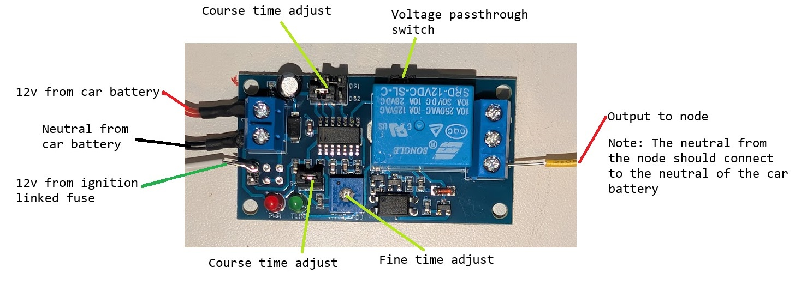
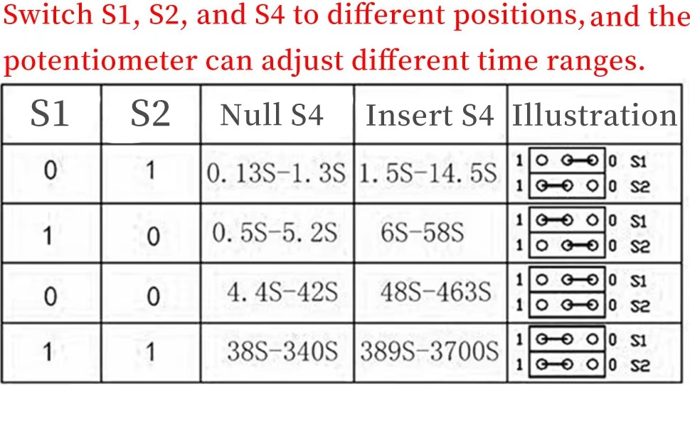
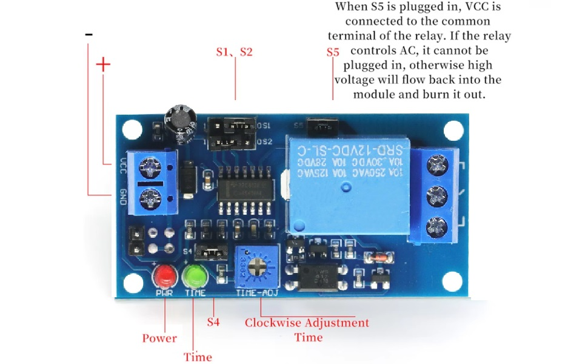
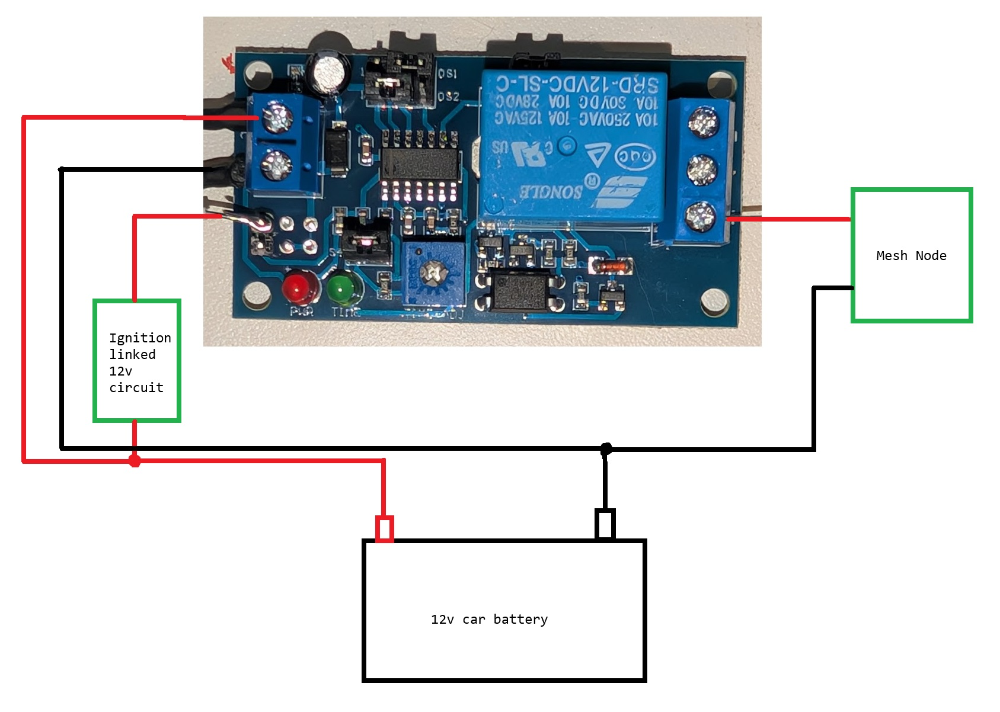

> Kerchow!  
> &mdash; <cite>Lightning McQueen</cite>  
  
## Power Management
### Auto-Shutdown Circuit
If you want to power your car node from the car's battery but don't want it to stay on at all times, you could install a delayed shutoff circuit. With [one of these boards](https://www.amazon.com/dp/B0DQFXT8X6) you can configure your node to turn off between 0.1 seconds and 1 hour after you turn your car off.[^Diab]   

  

Refer to this table for how to adjust the course time delay. If you are looking at the board above, the jumper pins are "1" if they connect the left and center pins, and "0" if they connect the center and right pins. For S4 (The lower course time adjust), instead of moving the jumper left and right, you pull it out (Null) and put it in (Insert).   

    
  
If the S5 jumper (Voltage passthrough switch) is plugged in, then the input voltage will be passed through to the common output pin, meaning that you don't need to plug anything into it. However, if you want to use the board to switch some other circuit, you can remove the S5 jumper.   

  

Here is an example wiring diagram:   

  
  
## Sources
[^Diab]: Information gathered from Diab on the MSPMesh Discord server.