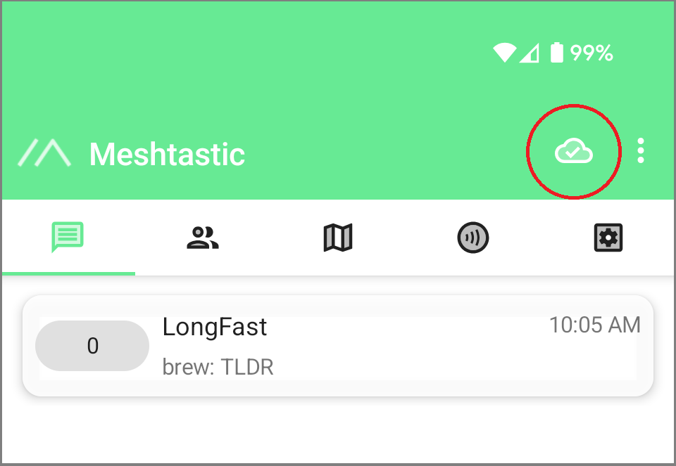
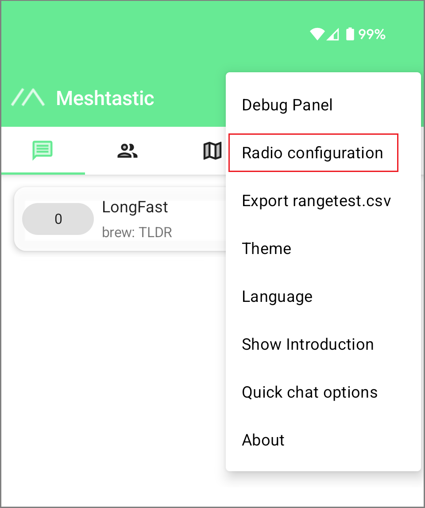
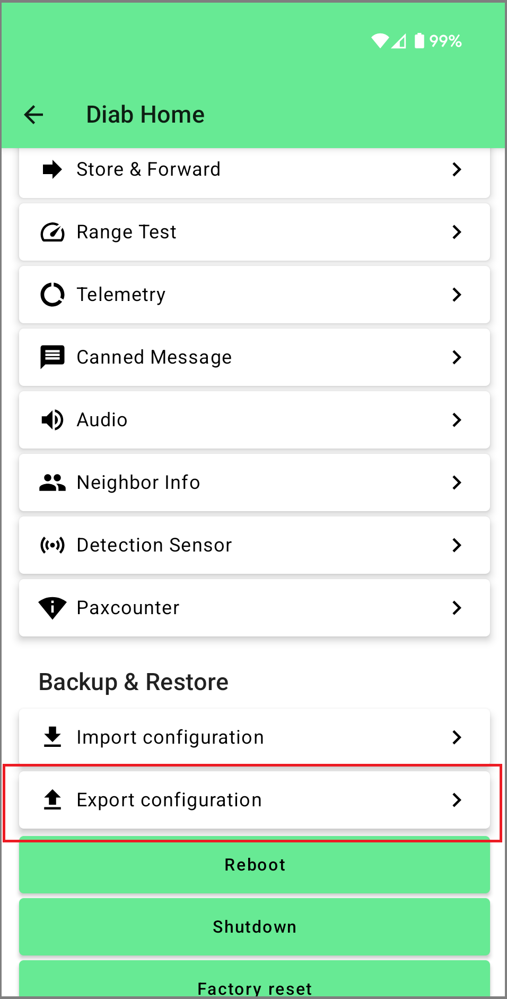

## Backing up node config
It is a good idea to occasionally export your node config, especially before a version update, so that you can get it back up and running if it has a software glitch. 
### Android 

1. Make sure you are connected to your node:  
   

2. Open the three dot menu at the top right and tap "Radio Configuration"  
   

3. Scroll down to the bottom and tap "Export configuration"  
   
  
### iPhone  
To be created!    
If you have an iPhone and would like to update this page with a tutorial, please see the [contribution guide](contribute_to_this_wiki.md)