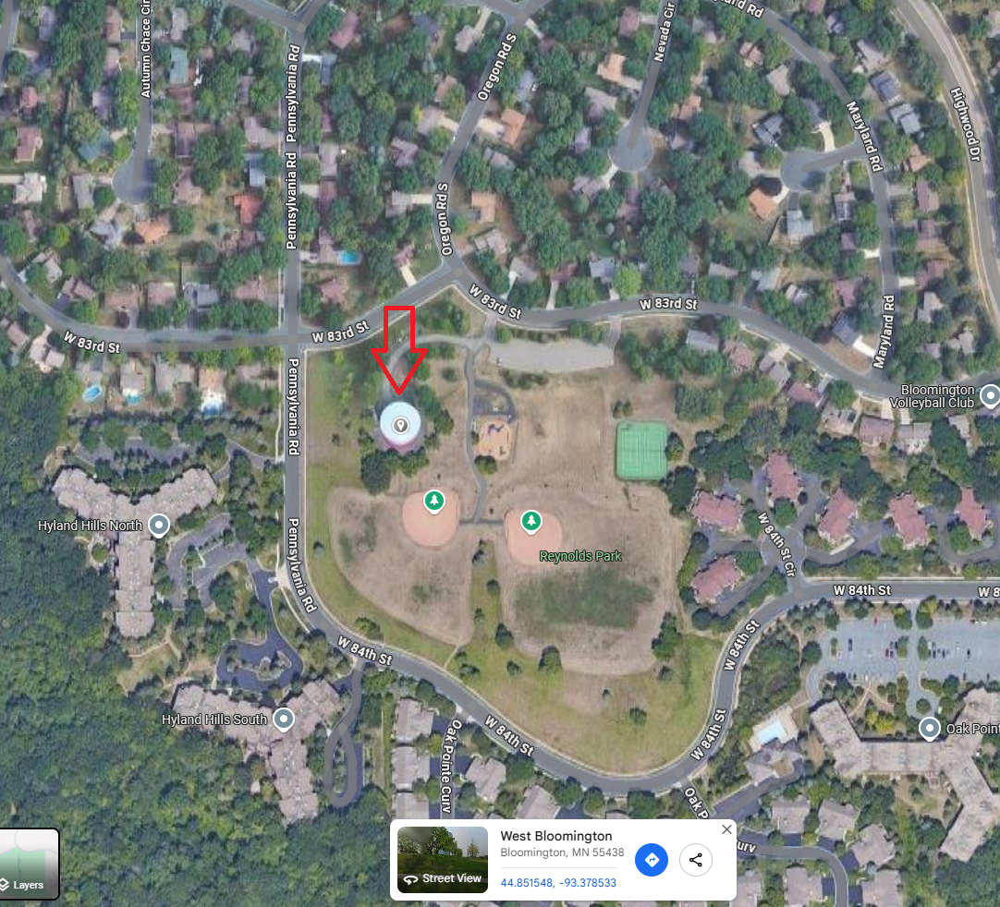
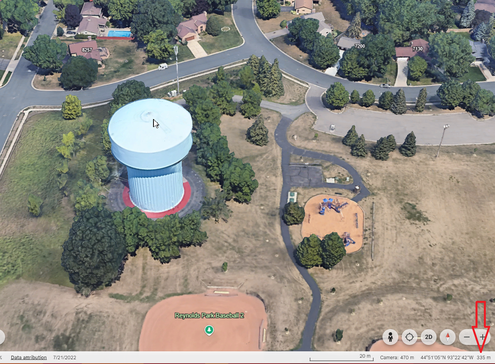
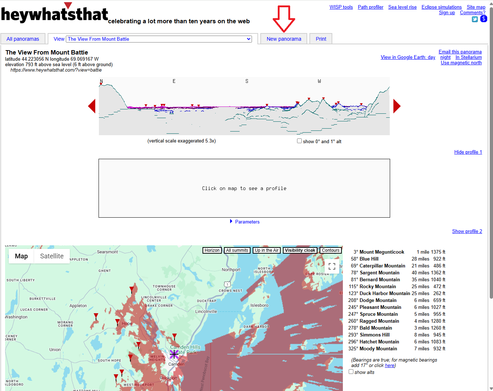
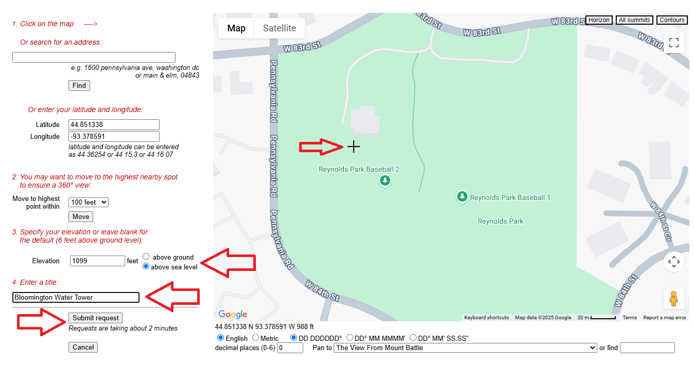
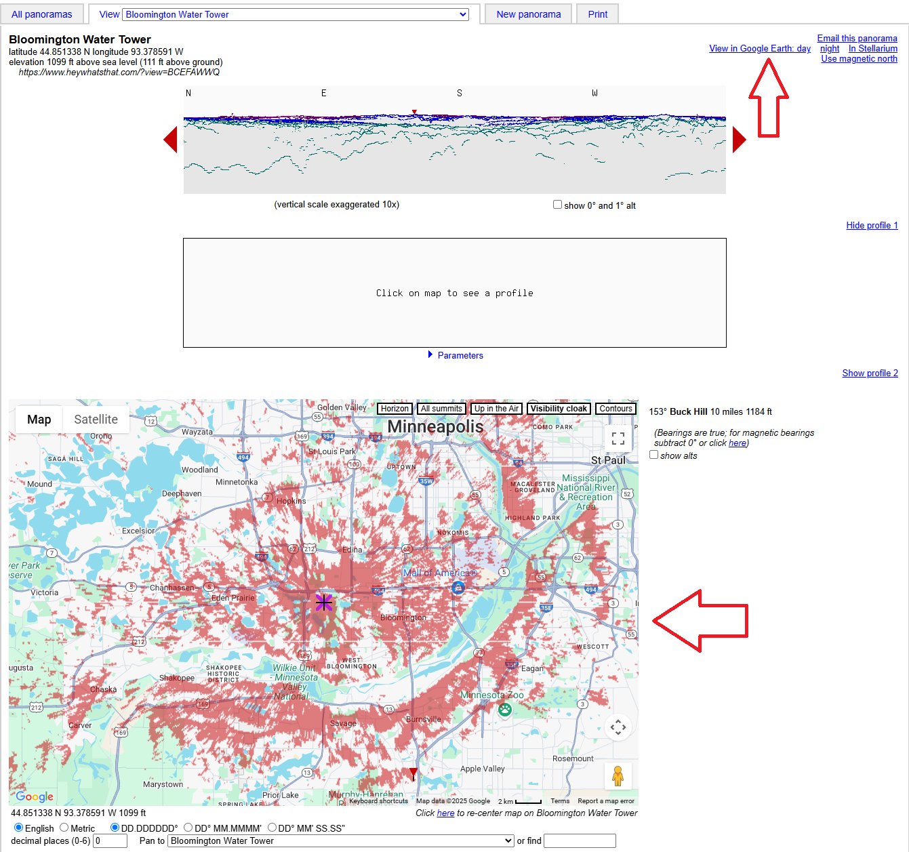

## What is HeyWhatsThat?
HeyWhatsThat is a free tool that allows you to visualize the potential coverage of an existing or planned node. The tool was originally designed for users to identify mountains and peaks in the distance, and what you can see if you're standing somewhere up high. However, we've been able to adapt it to visualize what your node can "see". We call this area "coverage" or "splash".

## How to use HeyWhatsThat
The website works best on a desktop computer, but it is possible to use it on a mobile device. The website is not very mobile friendly, so you may have to zoom in and out a lot.
1. Go to [HeyWhatsThat](https://heywhatsthat.com/)
2. Click on the "New Panorama" button at the top of the page.
3. Input the location of your node. You can either enter the coordinates manually, input your address, or click on the map to place a marker.
    * Note: I would not recommend using the "Move to highest point" tool, as it will place the marker at the highest point in the area, which may not be where your node is located.
4. Specify the height of your node, which should be the height of the antenna. Here are some tips for entering the height:   
    * The height you enter does not have to be particularly accurate since the coverage is an estimate.  
    * Normal buildings have a height of 10 feet per story. 
    * You can use Google Earth to measure the height of a building or other structure if they have made a 3D model of it.
5. Enter a name for your coverage map, and click "Submit Request".
6. Wait for the map to load. This may take a few minutes, depending on how busy the server is.
7. You should now see a map of the area around your node, with a red "splash" indicating the coverage area. The red splash is the area that your node can "see" from its location.
8. Optionally you can export the coverage map as a KMZ file, which can be opened in Google Earth or other mapping software. To do this, click on the "View in Google Earth" button at the top right of the page.   
    * We have some tools to help manipulate the KMZ files, which you can find in the [tools section](../tools/hwt_tools.md).   
    * Note: The exported KMZ file will show the exact location of the node, so you may want to use the KMZ stripper tool to remove the identifying information.

## Example
In this example we will create a coverage map for the top of a water tower in Bloomington, Minnesota. Here is the location on google maps:
 

To get the height of the water tower, we can use Google Earth. If you hover over the water tower, you can see the height of the water tower in the bottom right corner. This height is in meters and from Mean Sea Level (MSL). In this example, it shows as "335m". HWT lets us input the height as either height above ground or height above sea level, so we can use this value directly. It will need to be converted to feet, in this case it is 1099 feet.    

Now we can go to HWT and click on "New Panorama" at the top of the page.    
  

Now we can enter the location of the water tower. We can either enter the coordinates manually, input the address, or click on the map to place a marker. In this case, we will click on the map to place a marker. This does not have to be spot on the water tower since the coverage is a pretty rough estimate.   
Next enter the height of the water tower, which we found to be 335m or 1099 feet. Make sure to select "above sea level" if you are using the height from Google Earth.   
Next, enter a name for the coverage map. This can be anything you want, but it is helpful to use a descriptive name so you can remember what it is later. In this case we will call it "Bloomington Water Tower".   
Finally, click on "Submit Request" to generate the coverage map.     
  

After a few minutes, the coverage map should load. You can zoom in and out to see the coverage area. The red splash is the area that your node can "see" from its location. You can also click on the "View in Google Earth" button at the top right of the page to export the coverage map as a KMZ file.   
  